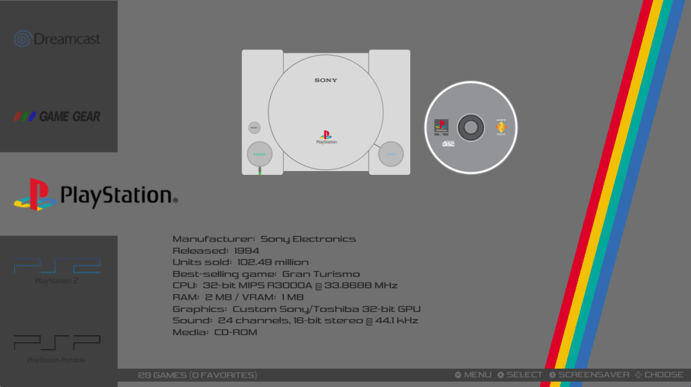
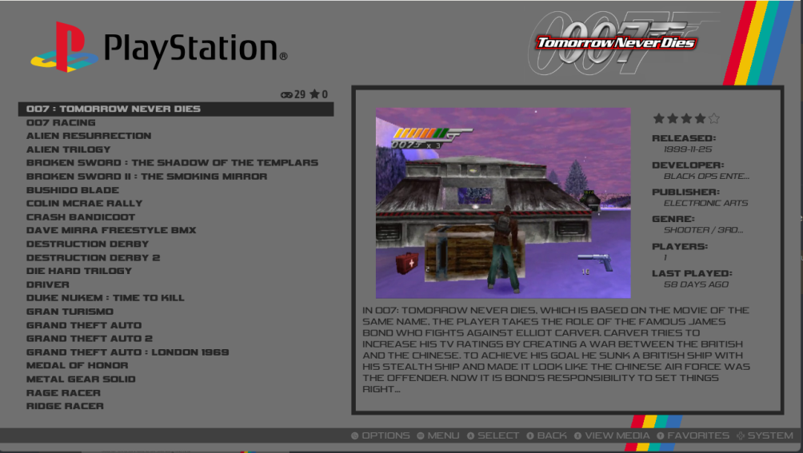

# PandS-DE for EmulationStation Desktop Edition

PandS-DE is a theme set for ES-DE that supports all systems as well as the latest application features.

The following options are included: 

2 variants:

- Textlist with videos
- Textlist without videos

2 color schemes:

- Dark mode
- Light mode

2 aspect ratios:

- 16:9
- 4:3

There is no need for a dedicated 16:10 aspect ratio as the 16:9 layout scales really well.

